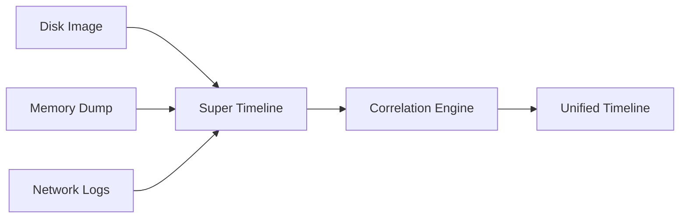

### **Artikel Praktikum: Hari ke-9 - Advanced Timeline Analysis dengan Super Timeline**  

---

#### **Pengantar**  
Hari kesembilan kita naik level ke **advanced timeline analysis** - teknik yang menggabungkan data dari **multiple sources** (disk, memory, network, logs) menjadi satu timeline terpadu. Ini adalah skill krusial untuk:  
- **Rekonstruksi serangan kompleks** (e.g., APT dengan multi-vector)  
- **Mendeteksi "blind spot"** yang terlewat saat analisis terpisah  
- **Membuat visualisasi investigasi** yang komprehensif  

**Tujuan Hari Ini**:  
- Teori (20%): Konsep super timeline, data fusion, dan correlation techniques.  
- Praktik (80%): Membuat super timeline dengan Plaso + Timesketch.  

---

### **Bagian 1: Teori (20%) - Advanced Timeline Concepts**  
#### **1. Apa itu Super Timeline?**  
**Definisi**: Timeline yang menggabungkan event dari **semua sumber data** (filesystem, registry, memory, network, application logs) dalam satu kerangka waktu terstandarisasi.  

**Perbandingan dengan Basic Timeline**:  
| Aspek | Basic Timeline | Super Timeline |  
|-------|----------------|----------------|  
| **Sumber Data** | 1-2 sumber (e.g., disk only) | Multi-sumber (disk + memory + network) |  
| **Granularitas** | Menit/jam | Milidetik |  
| **Correlation** | Manual | Otomatis dengan AI/ML |  
| **Output** | Tabel sederhana | Visualisasi interaktif + graph |  

#### **2. Teknik Data Fusion**  
**Proses Penggabungan Data**:  

**Tantangan**:  
- **Timezone Sync**: Konversi semua timestamp ke UTC.  
- **Event Normalization**: Standarisasi format event (e.g., file_created, process_executed).  
- **Noise Reduction**: Filter event tidak relevan (e.g., system updates).  

#### **3. Correlation Techniques**  
| Teknik | Deskripsi | Contoh |  
|--------|----------|--------|  
| **Temporal Correlation** | Event terjadi dalam jendela waktu dekat | File download → file execution (dalam 5 detik) |  
| **Causal Correlation** | Event A memicu Event B | USB plugged → autorun.inf executed |  
| **Pattern Matching** | Deteksi pola serangan | Kill chain: Recon → Weaponization → Delivery |  

---

### **Bagian 2: Praktik (80%) - Membuat Super Timeline**  
#### **Tools yang Digunakan**  
- **Plaso (log2timeline)**: Tool untuk generate timeline dari multi-sumber.  
- **Timesketch**: Analisis dan visualisasi super timeline.  
- **Dataset**:  
  - Disk Image: [NPS Image](https://digitalcorpora.org/corpora/drives/nps-2009-ubnist1/)  
  - Memory Dump: [Memory Sample](https://downloads.volatilityfoundation.org/volatility/samples/nps-2009-gen2/nps-2009-gen2-mem.vmem)  

---

#### **Langkah 1: Install Plaso & Timesketch**  
```bash
# Install Plaso
sudo apt install -y plaso-tools

# Install Timesketch (jika belum dari Hari 7)
docker run -p 5000:5000 --name timesketch -d us.gcr.io/osdfir/timesketch:latest
```  

---

#### **Langkah 2: Generate Timeline dari Disk Image**  
```bash
# Konversi E01 ke DD
ewfexport -f dd -o nps.dd nps-2009-ubnist1-gen2.E01

# Generate timeline dengan Plaso
log2timeline.py \
  --partition_offset=2048 \
  --vss_stores=all \
  --parsers="winreg,usnjrnl,pe,lnk,prefetch" \
  --temporary_directory=/tmp \
  disk_timeline.plaso \
  nps.dd
```  
**Parameter Penting**:  
- `--parsers`: Fokus ke parser Windows (registry, USN journal, PE files).  
- `--vss_stores=all`: Include Volume Shadow Copies.  

---

#### **Langkah 3: Generate Timeline dari Memory Dump**  
```bash
# Ekstrak timeline dari memory dump
log2timeline.py \
  --temporary_directory=/tmp \
  memory_timeline.plaso \
  nps-2009-gen2-mem.vmem
```  

---

#### **Langkah 4: Gabungkan Timeline**  
```bash
# Merge disk + memory timeline
psort.py \
  -o timesketch \
  -w super_timeline.plaso \
  disk_timeline.plaso \
  memory_timeline.plaso
```  

---

#### **Langkah 5: Analisis di Timesketch**  
1. **Import Super Timeline**:  
   - Buka `http://localhost:5000` → Create sketch `Day9_Super_Timeline`.  
   - Upload `super_timeline.plaso`.  

2. **Advanced Query**:  
   ```sql
   # Cari pola serangan APT
   (event_type:"pe:compilation" AND timestamp:"2009-01-15*") 
   OR 
   (event_type:"network:connection" AND destination_port:"4444")
   OR 
   (event_type:"reg_modified" AND key_path:"*\\Run")
   ```  

3. **Visualisasi Graph**:  
   - Pilih tab **Graph** → Pilih **Event Graph**.  
   - Zoom ke periode 15 Januari 2009 (puncak aktivitas).  
     

4. **Correlation Analysis**:  
   - Gunakan **Sketch** untuk dokumentasi:  
     ```markdown
     ## APT Attack Timeline  
     ### 2009-01-15 14:23:00  
     - **Memory**: Process `backdoor.exe` executed (PID: 1234)  
     - **Disk**: File `C:\Temp\payload.dll` created  
     ### 2009-01-15 14:23:30  
     - **Network**: Connection to 192.168.1.100:4444  
     ### 2009-01-15 14:24:00  
     - **Registry**: Run key modified for persistence  
     ```  

---

### **Tugas Harian (Wajib Dikerjakan!)**  
#### **Skenario Kasus**:  
> *"Sebuah server diserang dengan teknik APT. Anda memiliki disk image dan memory dump. Buat super timeline untuk:  
> 1. Identifikasi initial compromise vector.  
> 2. Rekonstruksi kill chain attacker.  
> 3. Temukan evidence data exfiltration."*  

**Instruksi**:  
1. **Download Dataset**:  
   - Disk: [NPS Image](https://digitalcorpora.org/corpora/drives/nps-2009-ubnist1/)  
   - Memory: [Memory Dump](https://downloads.volatilityfoundation.org/volatility/samples/nps-2009-gen2/nps-2009-gen2-mem.vmem)  

2. **Generate Super Timeline**:  
   - Gunakan `log2timeline` untuk disk dan memory.  
   - Merge dengan `psort`.  

3. **Laporan**:  
   ```markdown
   ## Super Timeline Analysis Report  
   ### Initial Compromise  
   - **Time**: [timestamp]  
   - **Event**: [deskripsi]  
   - **Source**: [disk/memory]  
   ### Kill Chain  
   1. **Recon**: [timestamp] - [event]  
   2. **Weaponization**: [timestamp] - [event]  
   3. **Delivery**: [timestamp] - [event]  
   4. **Exploitation**: [timestamp] - [event]  
   5. **Installation**: [timestamp] - [event]  
   6. **C2**: [timestamp] - [event]  
   7. **Actions**: [timestamp] - [event]  
   ### Data Exfiltration  
   - **Time**: [timestamp]  
   - **Method**: [network/USB]  
   - **Evidence**: [event ID + screenshot]  
   ```  

---

### **Troubleshooting Umum**  
| Masalah | Solusi |  
|---------|--------|  
| `log2timeline` gagal di memory dump | Gunakan `--temporary_directory` dengan space cukup (min 10GB). |  
| Timeline tidak tergabung | Cek format file: semua harus `.plaso`. |  
| Timesketch crash | Restart Docker container: `docker restart timesketch`. |  
| Terlalu banyak noise | Filter dengan `--parsers` spesifik (e.g., hanya `pe` dan `winreg`). |  

---

### **Referensi**  
1. [Plaso Documentation](https://plaso.readthedocs.io/en/latest/)  
2. [Timesketch Super Timeline Guide](https://timesketch.org/guides/user/super-timeline/)  
3. [SANS Whitepaper: Timeline Analysis](https://www.sans.org/white-papers/36872/)  

---

### **Kesimpulan**  
Hari ini Anda telah:  
✅ Membuat super timeline dari multi-sumber data.  
✅ Melakukan advanced correlation antara disk dan memory.  
✅ Merekonstruksi kill chain attacker secara visual.  

**Pesan Penting**:  
> *"Super timeline adalah seni mengubah 'noise' digital menjadi 'signal' forensik. Semakin banyak sumber data yang Anda gabungkan, semakin jelas narasi investigasi!"*  

Siap untuk Hari ke-10? Kita akan mempelajari **Network Forensics dengan Wireshark**! 🌐🔍
